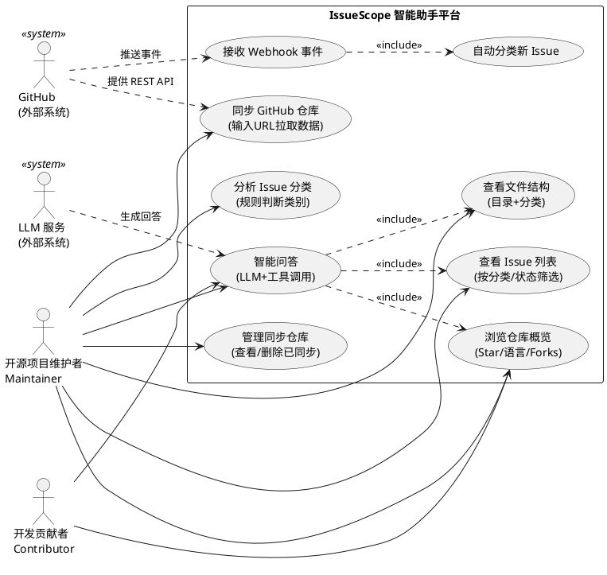
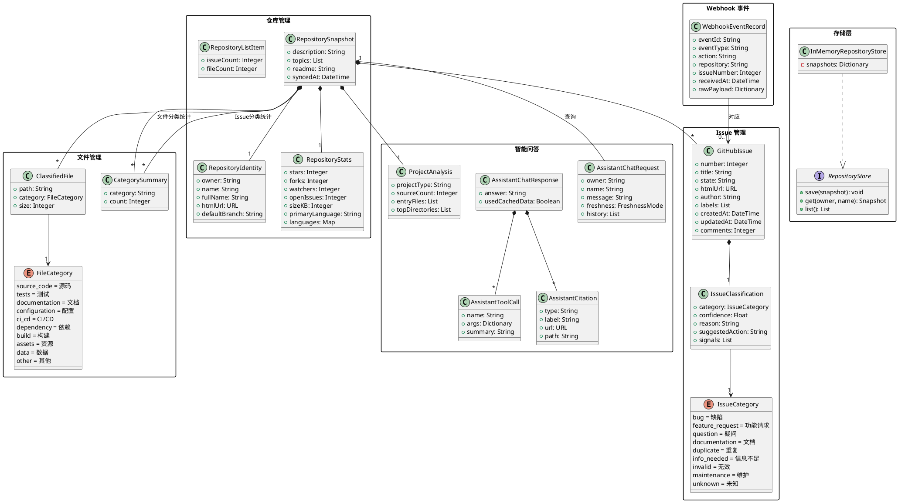

# IssueScope 系统 - 需求分析建模绘图 Prompt

> 将以下 Prompt 分别交给视觉大模型（如 DALL·E 3、GPT-4o 图像生成、Midjourney 等）生成 UML 图。
> 建议：先用 PlantUML 在线工具（kroki.io 或 plantuml.com）渲染，视觉效果更专业。

---

## 一、用例图 (Use Case Diagram)

### Prompt（中文，适用于 GPT-4o / DALL·E 3）

```
请绘制一张软件工程的 UML 用例图（Use Case Diagram）。

【标题】IssueScope - GitHub仓库问答与Issue分析系统 用例图

【左侧参与者（Actor，火柴人图标）】
- 开源项目维护者（Maintainer）
- 开发贡献者（Contributor）

【右侧外部系统参与者（Actor，方框+<<system>>标记）】
- GitHub（外部系统）
- LLM 服务（外部系统）

【系统边界框】标题为"IssueScope 智能助手平台"，包含以下用例（椭圆形）：

第一行（仓库管理）：
- 同步GitHub仓库 — 描述：「用户输入仓库URL，系统拉取并缓存仓库数据」
- 管理同步仓库 — 描述：「查看/删除已同步的仓库列表」
- 浏览仓库概览 — 描述：「查看仓库Star、语言、Forks等统计信息」

第二行（文件与Issue）：
- 查看文件结构 — 描述：「按目录树和文件分类浏览仓库文件」
- 查看Issue列表 — 描述：「按分类和状态筛选Issue列表」
- 分析Issue分类 — 描述：「输入标题和正文，规则判断Issue类别」

第三行（智能问答）：
- 智能问答 — 描述：「自然语言提问，LLM+工具调用自动回答仓库相关问题」

第四行（Webhook）：
- 接收Webhook事件 — 描述：「接收GitHub推送的Webhook事件」
- 自动分类新Issue — 描述：「收到新Issue事件时自动分类并更新缓存」

【参与者与用例的连线】
- Maintainer → 同步GitHub仓库
- Maintainer → 管理同步仓库
- Maintainer → 浏览仓库概览
- Maintainer → 查看文件结构
- Maintainer → 查看Issue列表
- Maintainer → 分析Issue分类
- Maintainer → 智能问答
- Contributor → 智能问答
- Contributor → 浏览仓库概览

【外部系统与用例的连线（虚线箭头）】
- GitHub → 同步GitHub仓库（标注：提供REST API数据）
- GitHub → 接收Webhook事件（标注：推送事件）
- LLM 服务 → 智能问答（标注：调用LLM生成回答）

【用例之间的依赖关系（虚线箭头+<<include>>标注）】
- 接收Webhook事件 ----<<include>>----> 自动分类新Issue
- 智能问答 ----<<include>>----> 浏览仓库概览
- 智能问答 ----<<include>>----> 查看文件结构
- 智能问答 ----<<include>>----> 查看Issue列表

【风格要求】
- 标准 UML 用例图风格
- 参与者用火柴人图标
- 用例用椭圆形
- 系统边界用矩形框
- 包含关系和扩展关系用虚线箭头并标注 <<include>>
- 整体清爽、适合放入学术文档
- 白色背景，黑色线条，适合打印
```

---

## 二、概念类图 (Conceptual Class Diagram)

### Prompt（中文，适用于 GPT-4o / DALL·E 3）

```
请绘制一张软件工程的概念类图（Conceptual Class Diagram），属于面向对象分析阶段。

【标题】IssueScope 系统 - 概念类图

【说明】类图分为 5 个包（Package），用虚线矩形框分隔。类之间用带多重性的连线表示关联关系。

===================================================================
包1：「仓库管理」包（左上角）
===================================================================

【类1：仓库标识 RepositoryIdentity】
属性：+owner: String, +name: String, +fullName: String, +htmlUrl: URL, +defaultBranch: String

【类2：仓库统计 RepositoryStats】
属性：+stars: Integer, +forks: Integer, +watchers: Integer, +openIssues: Integer, +sizeKB: Integer, +primaryLanguage: String, +languages: Map

【类3：仓库快照 RepositorySnapshot】
属性：+description: String, +topics: List, +readme: String, +syncedAt: DateTime

【类4：仓库列表项 RepositoryListItem】
属性：+issueCount: Integer, +fileCount: Integer

【包内关系】
- 仓库快照 ◆————1—— 仓库标识（组合关系，实心菱形在快照一侧）
- 仓库快照 ◆————1—— 仓库统计（组合关系）

===================================================================
包2：「文件管理」包（左中）
===================================================================

【类5：分类文件 ClassifiedFile】
属性：+path: String, +category: FileCategory, +size: Integer

【类6：文件类别枚举 FileCategory】（用 <<enumeration>> 标记）
值：源码source_code、测试tests、文档documentation、配置configuration、CI/CD、依赖dependency、构建build、资源assets、数据data、其他other

【类7：类别统计 CategorySummary】
属性：+category: String, +count: Integer

【包内关系】
- 分类文件 ——> 文件类别（依赖关系，箭头指向枚举）
- 仓库快照 ◆————*—— 分类文件（组合，1对多）
- 仓库快照 ◆————*—— 类别统计（组合，1对多，标注：文件分类统计）

===================================================================
包3：「Issue管理」包（右上角）
===================================================================

【类8：GitHubIssue】
属性：+number: Integer, +title: String, +state: String, +htmlUrl: URL, +author: String, +labels: List, +createdAt: DateTime, +updatedAt: DateTime, +comments: Integer

【类9：Issue分类结果 IssueClassification】
属性：+category: IssueCategory, +confidence: Float, +reason: String, +suggestedAction: String, +signals: List

【类10：Issue类别枚举 IssueCategory】（用 <<enumeration>> 标记）
值：缺陷bug、功能请求feature_request、疑问question、文档documentation、重复duplicate、信息不足info_needed、无效invalid、维护maintenance、未知unknown

【包内关系】
- GitHubIssue ◆————1—— Issue分类结果（组合，实心菱形在Issue一侧）
- Issue分类结果 ——> Issue类别（依赖，箭头指向枚举）

===================================================================
包4：「Webhook事件」包（右中）
===================================================================

【类11：Webhook事件记录 WebhookEventRecord】
属性：+eventId: String, +eventType: String, +action: String, +repository: String, +issueNumber: Integer, +receivedAt: DateTime, +rawPayload: Dictionary

【包内/跨包关系】
- Webhook事件记录 ————> GitHubIssue（关联，标注：对应）

===================================================================
包5：「智能问答」包（下方，横跨左右）
===================================================================

【类12：对话请求 AssistantChatRequest】
属性：+owner: String, +name: String, +message: String, +freshness: FreshnessMode, +history: List

【类13：对话响应 AssistantChatResponse】
属性：+answer: String, +usedCachedData: Boolean

【类14：工具调用 AssistantToolCall】
属性：+name: String, +args: Dictionary, +summary: String

【类15：引用来源 AssistantCitation】
属性：+type: String, +label: String, +url: URL, +path: String

【类16：项目分析 ProjectAnalysis】
属性：+projectType: String, +sourceCount: Integer, +entryFiles: List, +topDirectories: List

【包内关系】
- 对话响应 ◆————*—— 工具调用（组合）
- 对话响应 ◆————*—— 引用来源（组合）

【跨包关系】
- 对话请求 ————> 仓库快照（关联，标注：查询）
- 仓库快照 ◆————1—— 项目分析（组合，标注：分析结果）

===================================================================
包6：「存储层」包（左下角小框）
===================================================================

【接口：存储接口 RepositoryStore】（用 <<interface>> 标记）
方法：+save(snapshot): void, +get(owner, name): Snapshot, +list(): List

【类17：内存存储 InMemoryRepositoryStore】
属性：-snapshots: Dictionary

【关系】
- 内存存储 ..▷ 存储接口（实现关系，虚线空心三角箭头）

===================================================================
【风格要求】
- 标准 UML 类图风格，白色背景，黑色线条
- 每个类用三格矩形框（类名 | 属性 | 方法）
- 接口和枚举用 <<stereotype>> 标记
- 多重性标注在关联线两端：1 表示一个，* 表示多个，0..1 表示0或1个
- 菱形实心=组合（Composition），空心菱形=聚合（Aggregation），普通连线=关联
- 虚线+空心三角=实现接口，实线+空心三角=泛化/继承
- 每个Package用虚线大矩形框包围，框左上角标注包名
- 适合放入学术文档，字体清晰可读，建议A4横向排版
```

---

## 三、补充：PlantUML 源码（推荐方式）

> 如果视觉模型生成效果不理想，可以直接将以下 PlantUML 代码粘贴到
> **https://kroki.io** 或 **https://www.plantuml.com/plantuml/uml** 在线渲染成矢量图。

### 3.1 用例图 PlantUML



### 3.2 概念类图 PlantUML



---

## 四、使用建议

| 方式 | 适合场景 | 操作 |
|------|---------|------|
| **PlantUML 在线渲染**（推荐） | 论文、文档（矢量 SVG/PNG 导出） | 去 kroki.io 粘贴代码 → 下载图片 |
| **AI 图像生成 Prompt** | 快速出草图、PPT 示意 | 将上面的中文 Prompt 发给 GPT-4o / DALL·E 3 |
| **PowerDesigner 手绘** | 课程作业要求 `.oom` 文件 | 照上面的类名和关系在 PD 里建模 |
| **VS Code + PlantUML 插件** | 本地实时预览 | 安装 `jebbs.plantuml` 插件，新建 `.puml` 文件 |
